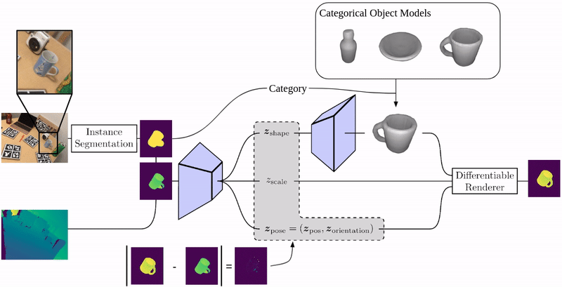
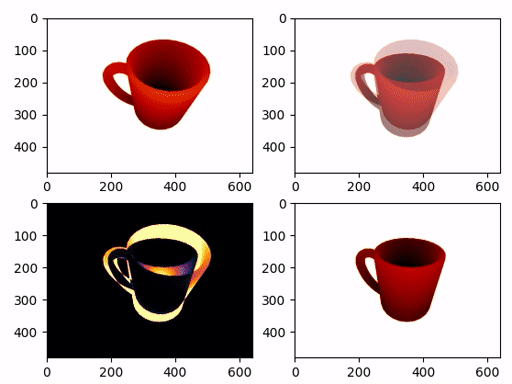
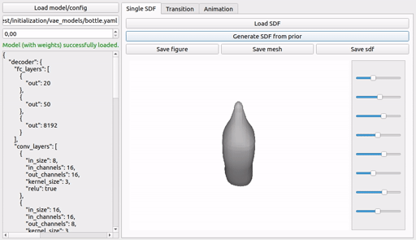

# SDFEst
SDFEst is a package for pose, scale, and shape estimation using discretized signed distance fields. It includes and combines three main components (generative model, discriminative initialization, and differentiable renderer) to enable pose and shape estimation in an analysis-by-synthesis framework.

[Installation](#installation) | [Dataset Preparation](#dataset-preparation)  | [Paper Reproduction](#paper-reproduction) | [Code Structure](#code-structure) | [Development](#development) | [Citation](#citation) | [Docs](https://roym899.github.io/sdfest/)



## Installation

You can install everything with pip (either in your global Python environment, or a virtual environment).

### Non-editable
```
pip install sdfest
```
In principle, this allows to train novel networks, apply the pipeline, use the individual modules, and reproduce our experiments.

### Editable (i.e., for modifying / experimenting with the code):
```
git clone git@github.com:roym899/sdfest.git
cd sdfest
pip install -e .
```
This will get the latest version of all dependencies, which might break if a breaking change was introduced in a dependency.
To reproduce our tested environment you can use the provided requirements.txt.

Execute the following command to install the packages and their dependencies. Note that this will likely downgrade / upgrade versions in your current environment, so it's better to use this in a virtual environment only.
```bash
git clone git@github.com:roym899/sdfest.git
cd sdfest
pip install -r requirements.txt -e .
```

### Optional: Detectron2
You need to install Detectron2 manually to run the pipeline with automatic instance segmentation.

Follow the [detectron2 installation guide](https://detectron2.readthedocs.io/en/latest/tutorials/install.html) from there.
Tested with detectron2 0.6 + torch 1.12.0 (and various older versions).

## Dataset Preparation
See below for expected folder structure for each dataset.

#### ShapeNet ([Website](https://shapenet.org/))
```
./data/shapenet/02876657/...
./data/shapenet/02880940/...
./data/shapenet/03797390/...
```

#### ModelNet ([Website](https://modelnet.cs.princeton.edu/))
```
./data/modelnet/bottle/...
./data/modelnet/bowl/...
./data/modelnet/cup/...
```

#### Redwood ([Website](http://redwood-data.org/3dscan/dataset.html))
```
./data/redwood/bottle/rgbd/...
./data/redwood/bowl/rgbd/...
./data/redwood/mug/rgbd/...
```

#### RGB-D Object Dataset ([Website](https://rgbd-dataset.cs.washington.edu/index.html))
```
./data/rgbd_objects_uw/{bowl,coffee_mug,shampoo,water_bottle}/{bowl,coffee_mug,shampoo,water_bottle}_1/
./data/rgbd_objects_uw/{bowl,coffee_mug,shampoo,water_bottle}/{bowl,cofee_mug,shampoo,water_bottle}_2/
...
```

## Paper Reproduction

First, make sure the datasets are in the right format.

### Full paper (training and experiments)
See the bash script in `reproduction_scripts/reproduce_paper.sh`.

Evaluation code for REAL275 and REDWOOD75 experiments will be integrated in [cpas_toolbox](https://github.com/roym899/pose_and_shape_evaluation) soon.

<sup>Non-cleaned up version of evaluation code can be found in `icaps_eval` branch.</sup>

### Train Models Only
To train a network for a specific category you need to first train a per-category VAE, and *afterwards* an initialization network.
#### VAE
First we need to convert the ShapeNet meshes to SDFs and optionally filter the dataset. To reproduce the preprocessing of the paper run
```bash
source preprocess_shapenet.sh
```
Then run
```bash
source train_vaes.sh
```
to train the models using the same configuration as used for the paper.

#### Initialization Network
To train the initialization network we used in our paper, run
```bash
source train_init_networks.sh
```
If you want to train the initialization network based on a previously trained object model, you need to create a new config linking to the newly trained VAE. 
See, for example, `sdfest/initialization/configs/discretized_mug.yaml`, which links to `sdfest/initialization/vae_models/mug.yaml`).

## Code Structure
Code is structured into 4 sub-packages:
- *vae*: variational auto-encoder for shapes
- *initialization*: pose and shape estimation from partial pointset
- *differentiable_renderer*: differentiable renderer for discretized SDF
- *estimation*: integration of VAE, differentiable renderer and single shot network into initialization + render and compare pipeline


### `sdfest.differentiable_renderer`



Differentiable rendering of depth image for signed distance fields.

The signed distance field is assumed to be voxelized and its pose is given by a x, y, z in the camera frame, a quaternion describing its orientation and a scale parameter describing its size. This module provides the derivative with respect to the signed distance values, and the full pose description (position, orientation, scale).

#### Generating compile_commands.json
<sup>General workflow for PyTorch extensions (only tested for JIT, probably similar otherwise)</sup>

If you develop PyTorch extensions and want to get correct code checking with ccls / etc. you can do so by going to the ninja build directory (normally `home_directory/.cache/torch_extensions/sdf_renderer_cpp`, or set `load(..., verbose=True)` in `sdf_renderer.py` and check the output), running
```
ninja -t compdb > compile_commands.json
```
and moving `compile_commands.json` to the projects root directory.


### `sdfest.vae`



Architecture to learn a low-dimensional representation of signed-distance fields (i.e., an explicit voxel representation of a signed distance function)

#### Preprocessing and training

You need to preprocess the mesh data prior to running the training script, like this:
```bash
python -m sdfest.vae.scripts.process_shapenet --inpath shapenet_subfolder --outpath output_path --resolution 64 --padding 2
```
You can control the resolution and added padding so that there is some empty space left in the signed distance field on all borders. If you are running this script via ssh you need to run `export PYOPENGL_PLATFORM=egl` prior to running the script and use the `--all` option which will disable any filtering. Otherwise mesh selection will proceed in two steps: first you see one mesh after another and need to decide which to keep. Pressing left will remove a mesh, pressing right will keep it. After a decision has been made, the conversion will run. Finally another manual selection process is started, where you can remove SDFs in which the mesh to SDF conversion has failed. 

To train the network you can now use either `python -m sdfest.vae.scripts.train` or `python sdfest/vae/scripts/train.py`.

#### config
Configuration can be provided through command-line arguments and hierarchical yaml files. The config files are read in depth first order and later specifications will overwrite previous specifications. 
To summarize:
- command line parameters will take precedence over all config files
- when specifying multiple config files, the second config file will overwrite params set by the first config file
- parent config files overwrite the params set in the contained config files

### `sdfest.initialization`
Architectures for single-shot SDF shape and pose estimation from a single (in the future possibly also multiple) depth views.

To train a new model run
```
python -m sdfest.initialization.scripts.train --config CONFIG_FILE
```
See the `sdfest/initialization/configs` or `reproduction_scripts` folder.

### `sdfest.estimation`
Modular architecture and experiments for SDF shape and pose estimation.

Combines initialization, VAE, and differentiable renderer for full analysis-by-synthesis.


## Development
- Use `pip install -e .` to install the package in editable mode
- Use `pip install -r requirements-dev.txt` to install dev tools
- Use `pytest --cov=sdfest --cov-report term-missing tests/` to run tests and check code coverage

## Citation

If you find this library useful in your research, consider citing our publication:

```
@article{bruns2022sdfest,
  title={{SDFEst}: Categorical Pose and Shape Estimation of Objects from {RGB-D} Images using Signed Distance Fields},
  author={Bruns, Leonard and Jensfelt, Patric},
  journal={IEEE Robotics and Automation Letters},
  year={2022},
}
```
