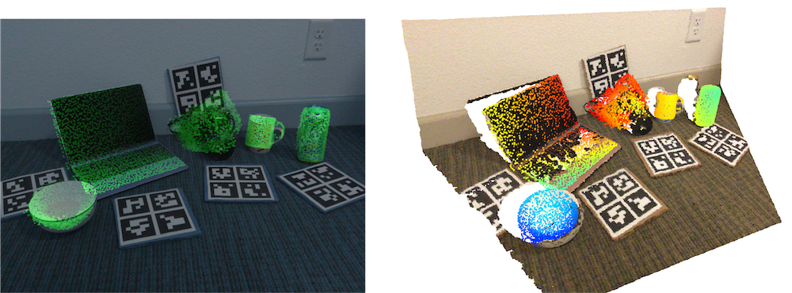

# ASM-Net: Category-level Pose and Shape Estimation Using Parametric Deformation

Created by Shuichi Akizuki (Chukyo University)



## Citation
If you find this repository useful in your work, please cite:
```
@inproceedings{Akizuki_2021_BMVC,
               author = {Akizuki, Shuichi and Hashimoto, Manabu},
               title = {ASM-Net: Category-level Pose and Shape Estimation Using Parametric Deformation},
               booktitle = {British Machine Vision Conference (BMVC)},
               year = {2021}
 }
```

## Introduction
This is a python implementation of [ASM-Net: Category-level Pose and Shape Estimation Using Parametric Deformation](https://sites.google.com/view/srs-lab/asm-net), a BMVC 2021 paper.

This repository includes:
- Test code of ASM-Net on NOCS REAL275 dataset
- Download link of the pretrained weights
- Active Shape Models for point cloud

## Requirements
Our codes have been tested with
- open3d==0.11.1
- opencv-python==4.4.0.44
- torch==1.7.0+cu110
- pytorch3d==0.4.0

## Test on NOCS REAL275 dataset
### Prepare dataset
Please download the NOCS REAL275 dataset from [this repository](https://github.com/hughw19/NOCS_CVPR2019#datasets).
We need "Test" of Real dataset, Ground truth pose annotation, and Object meshes.
Also, download the detection masks of Mask-RCNN on NOCS REAL275 dataset.
[Download link](https://drive.google.com/file/d/1z6u3Oo3eza9qftoiB21YVhP3W-hovAYv/view?usp=sharing)

Store these files under ```asm-net/data/```.


### Prepare the pretrained weights
Please download pretrained weights and parameters for Active Shape Model (ASM).
[Download link](https://drive.google.com/file/d/1fxc9UoRhfTsoV3ZML3Mx_mc79904zpcx/view?usp=sharing)

Unzip ```params.zip``` under ```asm-net/```.

Now, we assume your asm-net repository consist of:
```
asm-net
├── ASM_Net       ... Network description 
├── NOCS_loader   ... Codes for performance evaluation on NOCS REAL275 dataset.
├── dataset        
|      ├── gts             ... Ground truth pose annotation
|      ├── obj_models      ... Object meshes 
|      ├── real_test       ... "Test" set of NOCS REAL275 dataset
|      └── masks_real_test ... Detection mask by Mask-RCNN.
└── params         
       ├── asm_params  ... Parameters for ASM.
       └── params      ... Pretrained weights of ASM-Net
```

### Run ASM-Net
``` bash
cd ASM-Net
python test_net_nocs2019_release.py --vis --use_icp
```
Results are stored under ```asm-net/ASM_Net/release_proposed_out/real_test_wICP_YYYYMMDDhhmm```

### Evaluation
``` bash
cd NOCS_loader
python detect_eval.py --log_dir ../ASM_Net/release_proposed_out/real_test_wICP_YYYYMMDDhhmm/
```

## Reference
Our codes are based on the following repository.
- [Open3D-PointNet](https://github.com/isl-org/Open3D-PointNet)
- [NOCS_CVPR2019](https://github.com/hughw19/NOCS_CVPR2019)