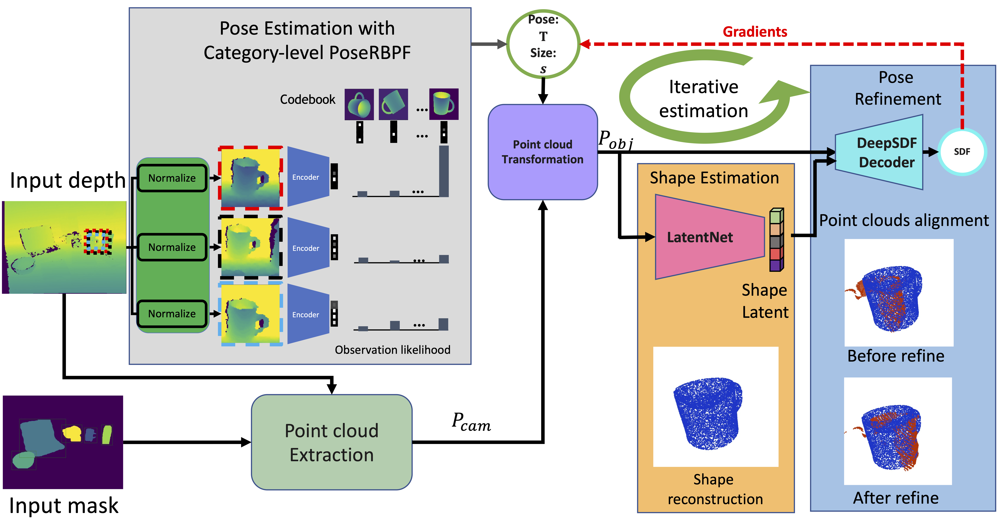

# iCaps: Iterative Category-Level Object Pose and Shape Estimation

* [iCaps Paper](https://arxiv.org/abs/2201.00059)
* [iCaps Video](https://www.youtube.com/watch?v=3AMcM3uUaUw)

## Citing iCaps
If you find the iCaps code useful, please consider citing:

```bibtex
@article{deng2022icaps,
  title={iCaps: Iterative Category-level Object Pose and Shape Estimation},
  author={Deng, Xinke and Geng, Junyi and Bretl, Timothy and Xiang, Yu and Fox, Dieter},
  journal={IEEE Robotics and Automation Letters},
  year={2022},
  publisher={IEEE}
}
```

## Installation 
```bash
git clone https://github.com/aerogjy/iCaps.git --recursive
```

Install dependencies:
- Install anaconda according to [the official website](https://docs.anaconda.com/anaconda/install/).
- Create the virtual env with ```icaps_env.yml```:
```angular2html
conda env create -f icaps_env.yml
conda activate icaps_env
``` 
- For 30XX GPU, you may run into pytorch issue. Follow this [solution](https://github.com/pytorch/pytorch/issues/45021#issuecomment-751585141) to fix it. 

- Compile the YCB Renderer according to the [instruction](https://github.com/NVlabs/PoseRBPF/tree/master/ycb_render).

- Compile the pointnet2:
```
cd pointnet2
python setup.py install
cd ../
```

- Compile the utitily functions.
```
cd ./utils/RoIAlign
sh build.sh
cd ../../
```

- Follow the instruction of [DeepSDF](https://github.com/facebookresearch/DeepSDF) to setup DeepSDF for training the NOCS objects.

## Download
- [Checkpoints](https://drive.google.com/file/d/1AvLMnHssLOpmWkDuWGsUvFNIfGjBC-ok/view?usp=sharing) and put in this folder, it will include deepsdf_ckpts and pointnet_ckpts besides the category-level PoseRBPF ckpts.
- [NOCS_dataset](https://drive.google.com/file/d/1Bd80m4wbnV63LR5KmeIV7z60QSaHKmQw/view?usp=sharing) and unzip to the upper folder.
- [obj_models](https://drive.google.com/file/d/1HS4hFc7J0ob3rNyyHTpEHBUXMJqOntZO/view?usp=sharing) and unzip to the upper folder.
- To re-train augmented auto-encoder for rbpf, download the [training model](https://drive.google.com/file/d/1Sy7D_1CSnwJIkeOFkjSmN30aR-IjrbCH/view?usp=sharing) and unzip to the upper folder.
- To re-train the latentnet, download [Latentnet_dataset](https://drive.google.com/file/d/1ErY3K_-R9SaAm1lww-Wczi-Yepz7Woox/view?usp=sharing) and unzip to the upper folder.

- Then you should have files organized like:
```angular2html
├── ...
├── iCaps
|   |── checkpoints
|   |   |── aae_ckpts
|   |   |── latentnet_ckpts
|   |   └── deepsdf_ckpts 
|   |── config                      # configuration files for training and PF
|   |── model                       # auto-encoder networks and latent-net
|   |── pose_rbpf                   # particle filters
|   └── ...
|── NOCS_dataset                    # to store NOCS data
|   |── gts
|   |── real_test
|   |── real_test_cass_seg 
|   └── real_test_obj_scale
|── obj_models                      # to store the CAD model
|   |── real_test
|   |── real_train 
|   |── train 
|   └── val
|── category-level_models           # to store CAD model for aae training
|   |── bottle
|   |── bowl 
|   |── camera 
|   |── can 
|   |── laptop 
|   └── ...
|── coco                            # distraction dataset for aae training
|   └── val2017
|── latentnet_dataset               # to store dataset for LatentNet training
|   |── bottle
|   |── bowl 
|   |── camera 
|   |── can 
|   |── laptop 
|   └── ...
└── ...
```

## Run
To run the main filter for testing:
```
sh scripts/test_nocs/test_laptop.sh 0 1
```
The results are saved to the ./results folder. You can visualize the shape of a specific frame (e.g. 20) with. 
```
python visualize_shape_point_cloud.py --exp exp60 --category laptop --seq 1 --shape_est_file shape_pcd_est_laptop_20.ply --partial_point_cloud_file shape_pcd_partial_laptop_20.ply
```

## Training
To train the category-level autoencoder:
```
sh scripts/train/train_script_laptop.sh
```

To train the LatentNet based on depth pointcloud and latent vector from DeepSDF:
```
sh scripts/train/train_script_laptop_pn.sh
```
